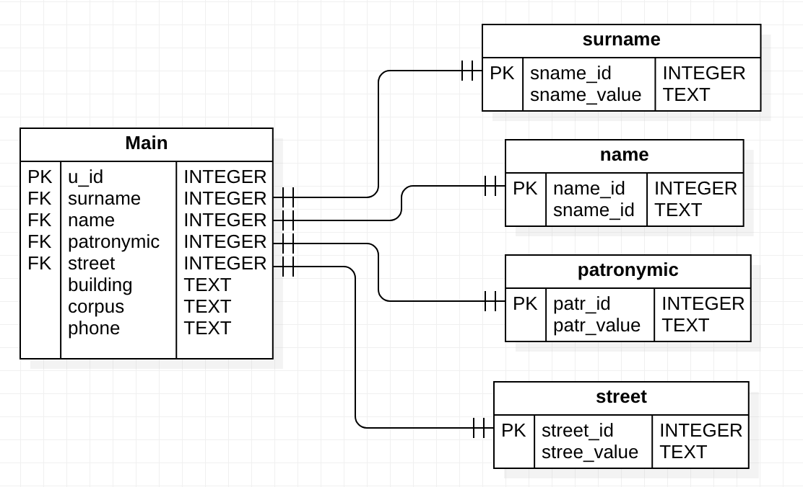

# Разработка приложения в архитектуре клиент-сервер
Данная работа направлена на создание приложения реализованного в архитектуре клиент-сервер. Приложение должно выполнять функции телефонного справочника. Для создания такого приложения необходимо выполнить следующие шаги:
- создать БД на сервере SQL;
- в БД создать необходимые таблицы;
- для созданных таблиц определить первичный ключ и внешние ключи;
- создать программу, реализующую интерфейс с пользователем (клиентскую часть) и обеспечивающую доступ к хранимым данным через обращения к серверу БД.
Структура базы данных показана на рисунке 1 и содержит следующие таблицы: справочники фамилий, имен, отчеств, наименований улиц, и т.д., а также, сводная таблица.

  

Рисунок 1. Структура базы данных

Клиентская часть приложения «Телефонный справочник» состоит из пяти экранных форм, реализующих интерфейс с пользователем и необходимые алгоритмы обработки данных. Для работы с родительскими таблицами БД используются похожие формы, которые отличаются только именами таблиц в обработчиках событий элементов интерфейса. 
Интерфейс написан на языке С++ с использованием фреймворка QT.

## Скриншоты

Главное меню

Меню фамилий

